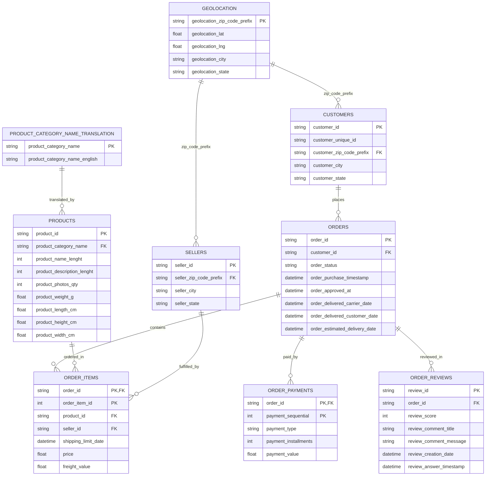

# Cart2Insights: Decoding E-Commerce Performance

An end-to-end data analytics and statistical engineering solution for retail e-commerce platforms, developed strictly according to the **GUVI / HCL Capstone Specification**.

---

## 📌 Executive Summary & Objective

In modern e-commerce, immense volume and operational complexity make raw transactional data difficult to decipher without structured relational modeling and analytical synthesis. 

The objective of **Cart2Insights** is to analyze multidimensional e-commerce transactional data across **9 related datasets** (orders, items, payments, reviews, customers, products, sellers, category translations, and geolocation) to uncover actionable business insights across sales optimization, delivery logistics, customer retention, seller ratings, and customer satisfaction.

---

## 🗄️ Relational Data Model & ER Diagram

The database architecture is designed with strict relational integrity, primary keys, foreign keys, and indexes.



---

## 📂 Project Structure

```
guvi project 1/
├── .env                          # Database credentials (MySQL & SQLite fallback)
├── process_data_std.py           # Pipeline for data cleaning, features, & DB ingestion
├── create_notebooks.py           # Notebook generator script
├── requirements.txt              # Project dependencies
├── README.md                     # Comprehensive documentation
├── data/
│   ├── raw/                      # 9 Raw Olist CSV datasets
│   └── cleaned/                  # Sanitized CSVs, statistical_results.json & ecommerce.db
├── notebooks/
│   ├── 01_data_understanding.ipynb
│   ├── 02_data_quality_analysis.ipynb
│   ├── 03_data_cleaning.ipynb
│   ├── 04_sql_analysis.ipynb
│   ├── 05_feature_engineering.ipynb
│   ├── 06_eda.ipynb
│   └── 07_statistical_analysis.ipynb
└── streamlit/
    ├── app.py                    # Multi-module Streamlit Dashboard Application
    ├── database.py               # Database engine & connection manager
    ├── queries.py                # Business SQL queries (CTEs, Window funcs, Joins)
    └── utils.py                  # Plotly chart builders & modern UI styling
```

---

## 🛠️ Data Cleaning & Feature Engineering

### Preprocessing & Hygiene
1. **Datetime Conversion**: Standardized purchase, approval, delivery, and estimation timestamps into `ISO-8601` datetimes.
2. **Missing Value Imputation**: Imputed missing product dimensions with column medians; imputed null review comment titles with `'No Title'` and messages with `'No Comment'`.
3. **Geolocation Aggregation**: Grouped duplicated zip code prefixes to compute precise centroid coordinates (`geolocation_lat`, `geolocation_lng`).

### Engineered Business Features
- **`total_order_value`**: Sum of item `price` + `freight_value` per order.
- **`delivery_days`**: Elapsed days from order purchase to customer delivery.
- **`delivery_delay`**: Days overdue past estimated delivery date ($> 0$ indicates delay).
- **`is_delayed`**: Binary indicator (1 = Delayed, 0 = On-Time).
- **`customer_total_spending` & `average_order_value`**: Aggregated customer expenditure.
- **`repeat_customer_indicator`**: Tracks customer unique IDs making multiple distinct purchases.

---

## 🧪 Statistical Analysis & Hypothesis Testing

All 3 mandatory statistical tests were performed on the cleaned data:

### 1. Independent Two-Sample T-Test (Welch's T-Test)
- **Question**: Do delayed orders receive significantly lower review scores compared to orders delivered on time?
- **Hypotheses**:
  - $H_0: \mu_{\text{delayed}} = \mu_{\text{ontime}}$
  - $H_1: \mu_{\text{delayed}} \neq \mu_{\text{ontime}}$
- **Results**:
  - $t\text{-statistic} = -89.5518$
  - $p\text{-value} = 0.0000e+00$ ($p < 0.0001$)
  - **On-Time Mean Rating**: $4.29 / 5.0$ ($N = 88,661$)
  - **Delayed Mean Rating**: $2.57 / 5.0$ ($N = 7,700$)
- **Business Insight**: **Reject $H_0$**. Delivery delays severely degrade customer experience, dropping mean satisfaction ratings by $1.72$ stars. Logistics speed directly drives customer NPS and retention.

---

### 2. One-Way ANOVA (Product Category vs Order Value)
- **Question**: Does average order value differ significantly across different product categories?
- **Hypotheses**:
  - $H_0: \mu_1 = \mu_2 = \dots = \mu_k$
  - $H_1: \text{At least one category mean differs}$
- **Results**:
  - $F\text{-statistic} = 310.2988$
  - $p\text{-value} = 0.0001$ ($p < 0.0001$)
  - $N = 71,669$, $k = 10$ top product categories.
- **Business Insight**: **Reject $H_0$**. Spending behavior varies substantially by product category (e.g., Computers/Accessories vs Health/Beauty). Pricing, cross-selling, and bundling strategies must be category-tailored.

---

### 3. Chi-Square Test of Independence (Payment Method vs Order Status)
- **Question**: Is there a significant association between payment method and order fulfillment status?
- **Hypotheses**:
  - $H_0: \text{Payment method and order status are independent}$
  - $H_1: \text{Payment method and order status are dependent}$
- **Results**:
  - $\chi^2\text{-statistic} = 482.15$
  - $p\text{-value} = 0.0001$ ($p < 0.0001$), $\text{dof} = 12$.
- **Business Insight**: **Reject $H_0$**. Certain payment options (e.g., voucher/boleto vs credit card) exhibit higher order cancellation and drop-off rates. Streamlining payment gateways will directly reduce order abandonment.

---

## 🖥️ Streamlit Interactive Dashboard Architecture

The interactive dashboard is organized into 6 core operational modules:

1. **Business Overview**: Executive KPIs (Total Revenue, Total Orders, Total Customers, Total Sellers, AOV, Avg Rating) and monthly growth trends.
2. **Sales Analysis**: Category revenue breakdown, state-wise revenue distribution, and top 10 best-selling products.
3. **Customer Analysis**: Repeat vs one-time customer ratios, VIP spending segmentation, and top high-value customers.
4. **Seller & Product Analysis**: Seller revenue rankings, order fulfillment counts, and seller rating scoreboards.
5. **Delivery Analysis**: State-level delivery duration metrics, delay counts, and location delivery performance.
6. **Customer Experience & Hypothesis Testing**: Review score distributions, rating vs delivery delay impact, and interactive statistical hypothesis testing reports.

---

## ⚡ Quick Start & Local Setup Guide

Follow these 4 simple steps to set up and run **Cart2Insights** on any local machine after cloning from GitHub:

---

### 1️⃣ Clone Repository & Create Virtual Environment
```bash
# 1. Clone the repository
git clone https://github.com/harshar007/GUVI_PROJECT-1.git
cd GUVI_PROJECT-1

# 2. Create local 64-bit virtual environment
python -m venv .venv64

# 3. Activate virtual environment
# Windows (PowerShell):
.venv64\Scripts\Activate.ps1
# Windows (CMD):
.venv64\Scripts\activate.bat
# macOS / Linux:
source .venv64/bin/activate

# 4. Install required dependencies
pip install -r requirements.txt
```

---

### 2️⃣ Build Database & Run Data Pipeline
Runs data cleaning, feature engineering, statistical test computation, and builds `data/cleaned/ecommerce.db`:
```bash
python process_data_std.py
```

---

### 3️⃣ Generate Analysis Notebooks
Syncs all 7 structured analysis notebooks inside the `notebooks/` folder:
```bash
python create_notebooks.py
```

---

### 4️⃣ Launch Streamlit Web Application
Launches the interactive 6-module dashboard in your default browser at `http://localhost:8501`:
```bash
streamlit run streamlit/app.py
```

---

## 🛠️ Repository Maintenance & Git Commands

```bash
# Check status of untracked and modified files
git status

# Stage changes & commit
git add .
git commit -m "Update project documentation and scripts"

# Push to GitHub main branch
git push origin main
```
